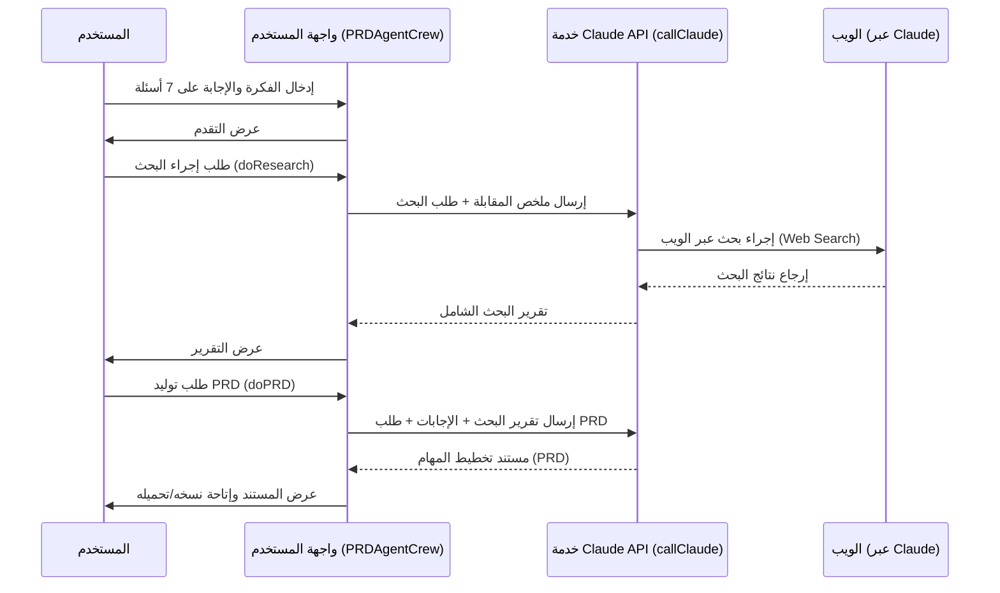
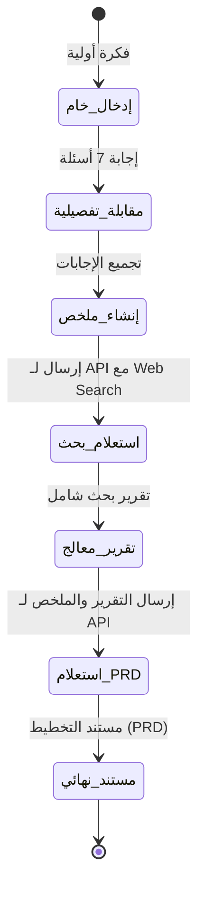

# الميكانيكية الأساسية (Core Mechanism)

## الملخص التنفيذي
هذا المستودع عبارة عن تطبيق ويب تفاعلي (مبني بـ React و Vite) يعمل كوكيل ذكاء اصطناعي لإنشاء مستندات تخطيط ومتطلبات المنتج (PRD). يدير التطبيق دورة حياة كاملة تبدأ بمقابلة المستخدم لجمع فكرته وتفاصيلها، مروراً بالبحث المتعمق عبر الويب باستخدام واجهة برمجة تطبيقات (Claude API)، وصولاً إلى صياغة مستند التخطيط النهائي.

## مسار التنفيذ الرئيسي

## دورة حياة البيانات

## جدول الطبقات المعمارية

| الطبقة | المسؤولية | المسارات/الملفات | المدخلات | المخرجات |
|---|---|---|---|---|
| التنسيق والحالة (Logic/State) | إدارة التنقل بين الخطوات، جمع البيانات، والاتصال بالخدمات الخارجية | `src/PRDAgentCrew.jsx` | تفاعلات المستخدم، بيانات Claude | حالات متغيرة تغذي مكونات واجهة المستخدم |
| واجهة المستخدم (Presentation) | عرض أقسام التطبيق المختلفة (المقابلة، البحث، الوثيقة) | `src/sections/*.jsx`, `src/components/*.jsx` | خصائص (Props) معتمدة على الحالة | أحداث مستخدم (onNext, onAnswer, إلخ) |
| الخدمات (Services) | التواصل مع واجهة Claude API | `src/utils/callClaude.js` | رسائل (Messages) وتحديد استخدام البحث من عدمه | سلاسل نصية (Markdown content) |
| الثوابت (Constants) | تخزين الإعدادات الثابتة كأمثلة الأسئلة | `src/constants/index.js` | لا يوجد | نصوص ثابتة |

## قرارات معمارية جوهرية (ADRs)

### 1: استخدام مكون رئيسي واحد لإدارة الحالة (Monolithic State File)
- **القرار:** تم تجميع أغلب حالات التطبيق ودوال التعامل مع الواجهة (`useState()`, `doResearch()`, `doPRD()`) داخل `PRDAgentCrew.jsx`.
- **السبب:** لسهولة تمرير البيانات وتجنب تعقيدات بروتوكولات إدارة الحالة (Redux, Context) في تطبيق بخطوات متسلسلة (Linear Flow).
- **البدائل:** استخدام `useContext` أو مكتبات تفويض الحالة (Zustand).
- **التبعات:** ملف `PRDAgentCrew.jsx` ممتلئ، مما قد يعقّد الصيانة إذا كبر التطبيق، لكنه سهل التتبع الحالي لدورة البيانات البسيطة.

### 2: الاعتماد المباشر على Fetch للاتصال بالخدمات (Direct Claude API Fetch)
- **القرار:** تنفيذ اتصال مباشر مع Claude API في سياق العميل (Client-Side) باستخدام المتصفح مع تمرير ترويسة `"anthropic-dangerous-direct-browser-access": "true"`.
- **السبب:** تسريع عملية النمذجة وإلغاء الحاجة لبناء خادم خلفي (Backend) وسيط وتوفير الموارد.
- **البدائل:** إنشاء طبقة Backend في منصة مثل Node.js أو دوال Serverless لإخفاء مفتاح API وإدارة الطلبات.
- **التبعات:** قد يتعرض مفتاح API للانكشاف لأنه يُقرأ عبر `import.meta.env` داخل بيئة العميل.

### 3: استخدام دوال المساعدة لتقديم محتوى Markdown
- **القرار:** معالجة الإخراج من العميل وتحويله إلى ملفات تنزيل (Markdown text files) مباشرة في العرض دون معالجة خلفية.
- **السبب:** إرجاع الـ API نصوص Markdown المهيكلة بسهولة؛ والاعتماد على ميزات العميل لتنزيل الملفات `URL.createObjectURL(blob)`.
- **البدائل:** توليد الملف من الخادم (PDF/DOCX/MD).
- **التبعات:** خفة وسرعة التطبيق مع الحفاظ على قدرة التوافق مع برامج أخرى تفهم Markdown.
