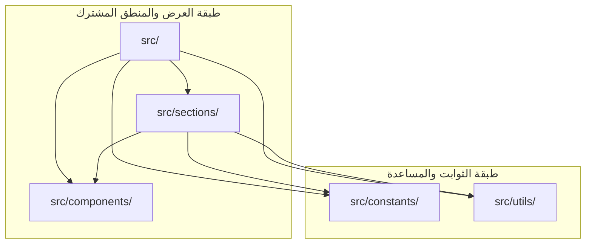
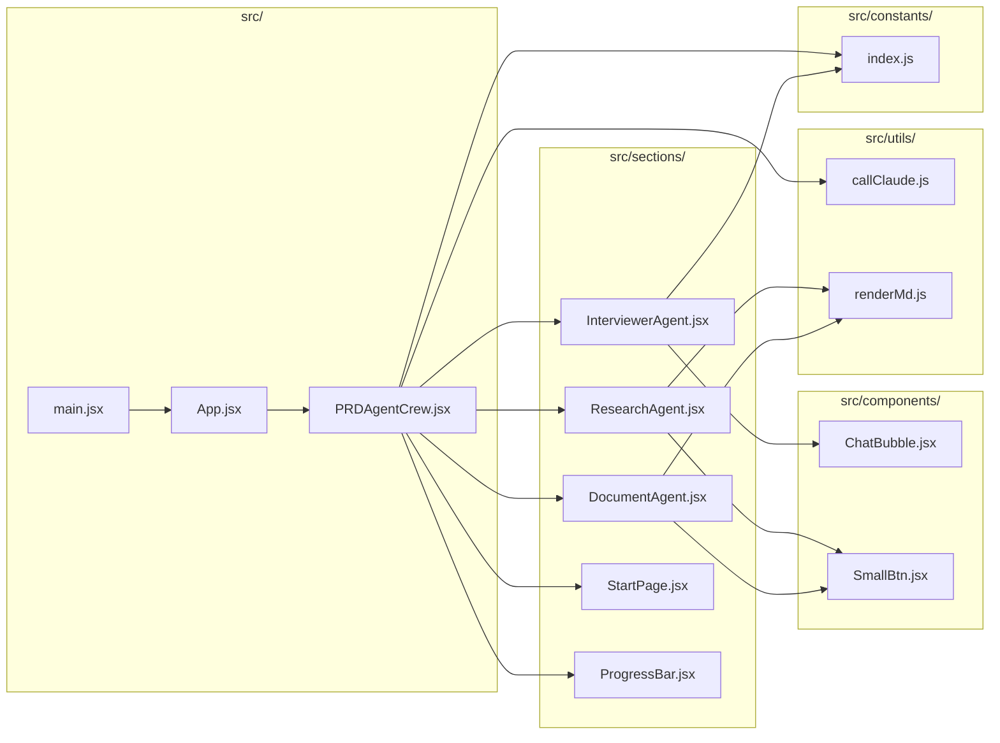
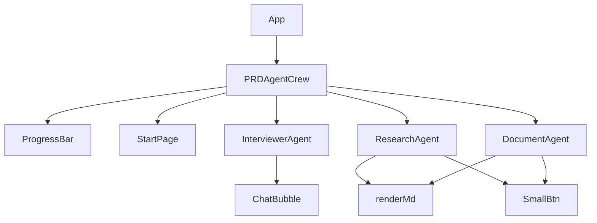

# علاقات الملفات (File Relations)

## تبعيات المجلدات (مستوى عالٍ)

## تبعيات الملفات داخل المجلدات الحرجة المشتركة

## تدفق البيانات لأهم 3 سيناريوهات استخدام

```mermaid
flowchart LR
    A[إدخال فكرة المشروع] --> B[مقابلة بـ 7 أسئلة]
    B -->|تخزين الإجابات| C[حالة PRDAgentCrew]
    C -->|تسليم الإجابات وموجه موحد| D[الوكيل البحثي]
    D -->|طلب عبر Claude API| E[تقرير البحث]
    E -->|تسليم التقرير + الإجابات| F[وكيل الوثيقة PRD]
    F -->|طلب عبر Claude API| G[مستند التخطيط النهائي]
```

## هرمية المكونات لواجهة المستخدم

